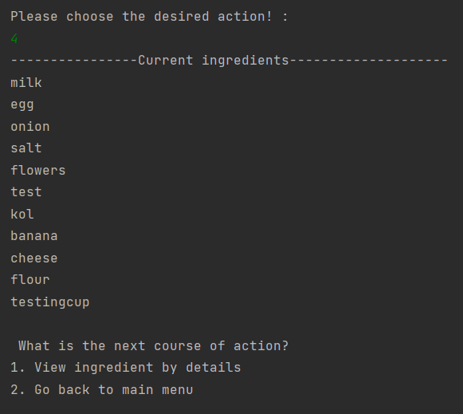
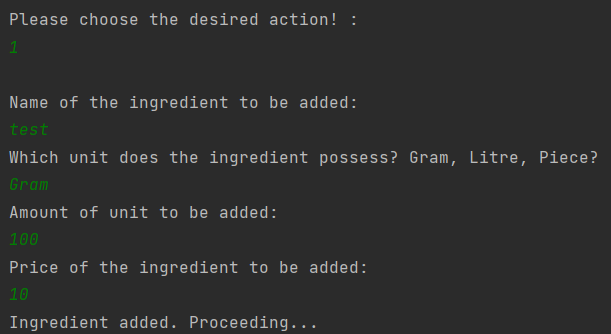
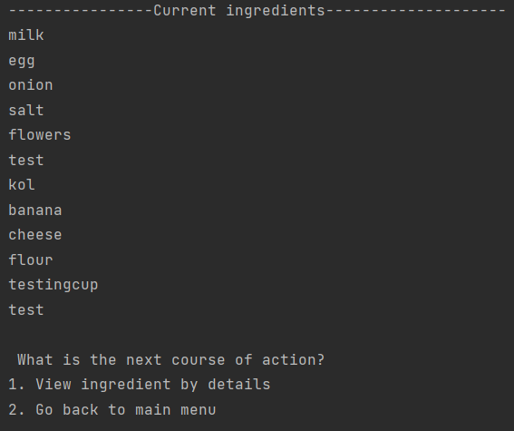
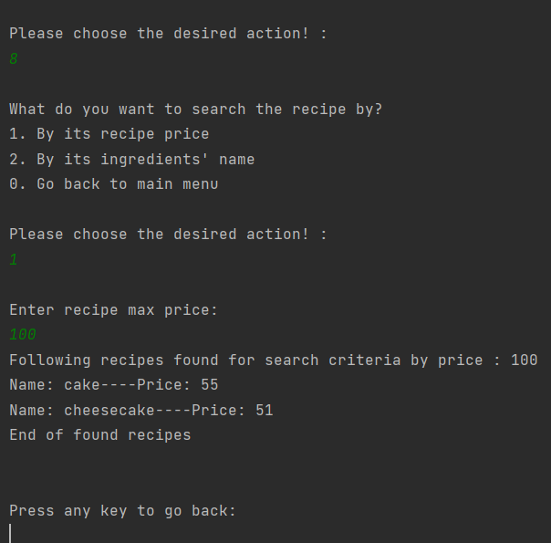
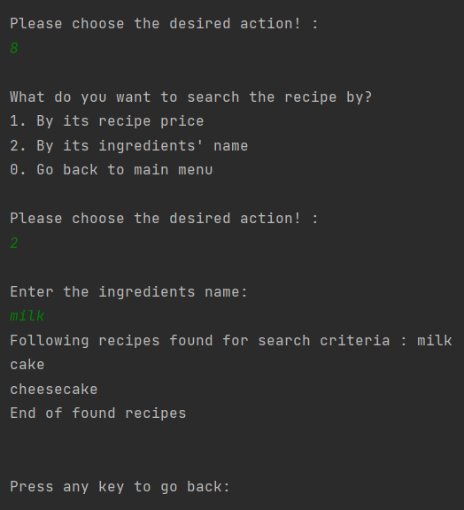

# ReadMe file by Fabian for the recipe app

## What is working? 
The base functionalities regarding adding, deleting, updating and viewing the recipes and ingredients although primitive
in nature (meaning that there is limited dynamic interaction between the classes and inputs are not exactly selective), 
they do work. The strategy pattern regarding searching was successfully implemented for the ingredients' name and recipe
price and seems to work. Below there will be various evidence provided regarding different functionalities of the application.

### Adding ingredients' proof of function

This is the list of ingredients before the additional ingredient is to be added.

This is the test ingredient that is to be added to the ingredients as a whole. 

The list of ingredients looks so after adding the test ingredient which proves that the functionality for adding 
ingredients does indeed work. 

### Searching recipes' proof of function

A price of desire is inserted (consider it as the max budget you have for a recipe) and then the application returns a 
list of recipes that are within that range. 

An ingredient's name is inserted and then the application returns a list of the recipes that do contain that particular 
ingredient which falls into compliance with the requirements of the application. 

These are just some proofs and the application has been tested in three different devices and in all of them, it 
functioned. There was a weird occurrence with one of the devices which had a 7th Gen Intel CPU for some reason however 
for the most part, the application did not crash and tests ran. 

## What is not working? & Usability Issues 
For the functionalities that are present at the time, they do work, although as mentioned before when the application 
was run in the device in which had a 7th Gen Intel I5 CPU, it did crash a few times for some reason. It crashed 
during the addition of the ingredient, updating and deletion of the recipe. Other than that, I did try to make a mostly
stable application and tried to fix the issues of the previous releases (before it crashed when adding a new ingredient).

I will now mention areas in which could be improved. For the sake of simplicity, I assigned units an enumeration class 
which seemed as a good idea considering that the user will choose one of the values in the small set of said units. 
It could be argued that in itself is quite restrictive because the user would want to add more units at one point or the
other however enumeration classes in general are not so problematic when it comes to unexpected bugs hence the choice. 
Another major point would be the restriction in selective choices (when an ingredient or recipe is updated, it is done 
completely). The choice was done so that the app would be simple to use and adding more complex choices would only 
expand the possibility of errors/bugs. 

In conclusion the application is far from perfect, but I believe it is suitable for a passing grade. 