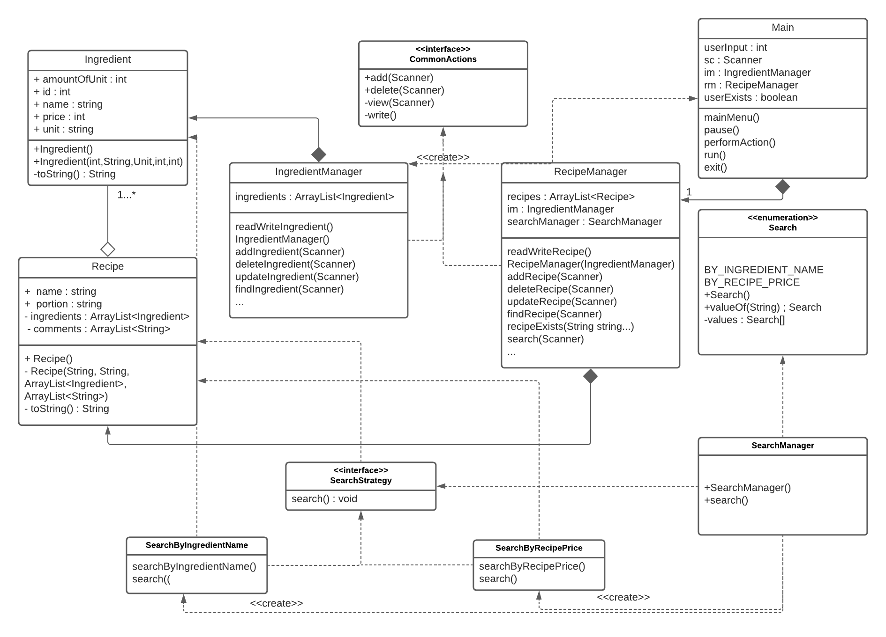
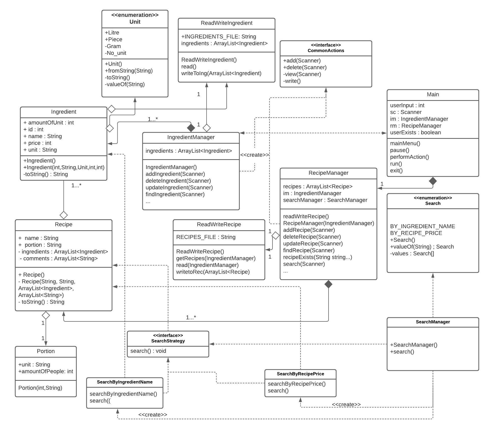
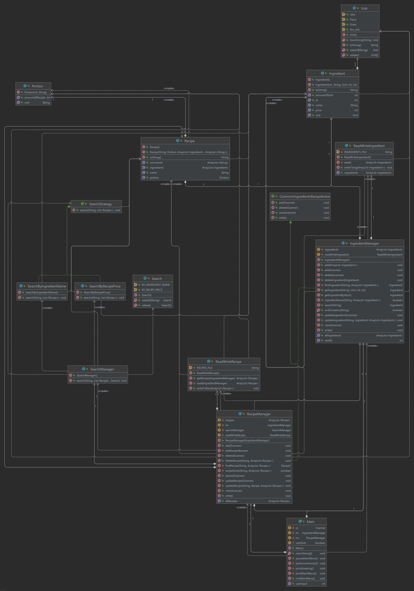

# Stages of design

## Initial design

## Final design

This is the design that was constructed with the use of Lucidchart and the notable changes that have been made to it are
related to "Portion" and "Unit" entities where they have been given a class of their own in order for the application to
be more truthful to OOP.

This is the diagram provided by IntelliJ through the plugin Diagrams which analyzes classes and determines automatically
a class diagram for the entire application. (There has been included a .uml file as well if supervisor wishes to examine
relationships more thoroughly). 
