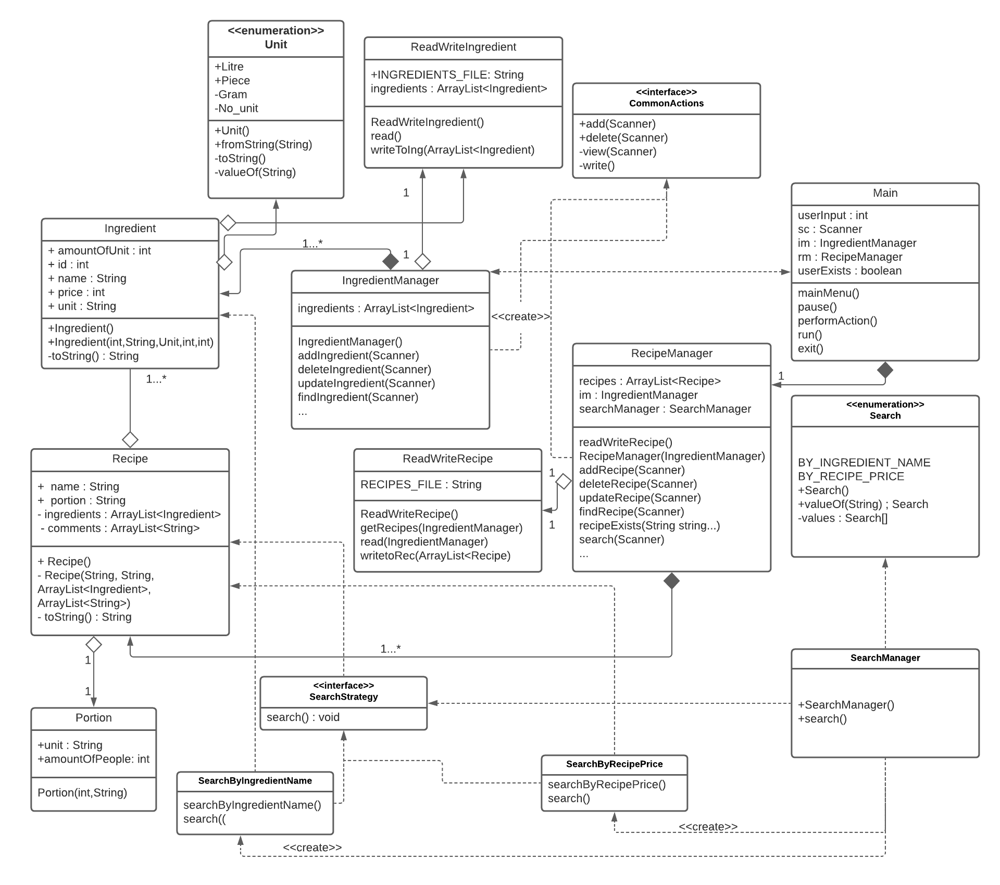
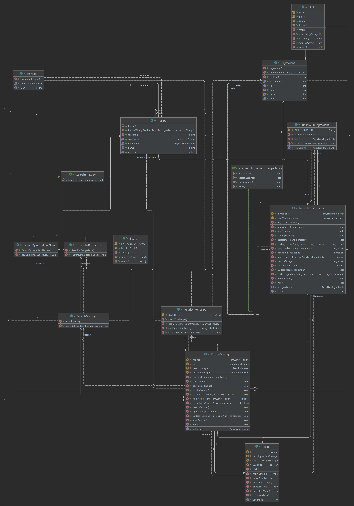

# Intended

## Essentials of the recipe application
The basis of the recipe application is to follow and implement OOP terms such as: dependency, realisation, strategy pattern,
etc. The domain model (ingredient, portion, recipe, search, and unit classes) should inspire the entire model as a whole.
Meaning that domain will shape up the managers, and the search strategy that is going to be implemented along with the 
utilities of reading the files where the ingredients and recipes can be found. 

## Domain 
Technically, a domain model can be defined as all the classes that model the shape of the recipe application. 
The recipe application in itself is about recipes, ingredients and their properties. So the domain classes would be: 
recipe, ingredient, portion, unit and search. Recipe would have properties such as name, portion, ingredients and 
comments whereas ingredients would have its name, unit, unit amount and price, etc.

## Managers
The managers would be classes regarding actions such as common actions regarding ingredients and recipes in the app, 
the ingredients' and recipes' manager (viewing details, adding, deleting, updating them and so forth). Along 
with these managers another one that is to be added is the search manager or more rightfully said a manager that 
coordinates with the search strategy that is to be implemented on searching a recipe based upon its price or name. 

## Strategies
The strategy that is going to be  implemented is the search strategy pattern that will look upon the input (whether it 
will be the price or the ingredients' name present in the recipe) and provide the results directly. 

## Utilities
Utils are actions regarding the reading and writing of the files for ingredients and recipes. The file format that is 
going to be used is the txt one. 

## Initial design

## Final design

This is the design that was constructed with the use of Lucidchart and the notable changes that have been made to it are
related to "Portion" and "Unit" entities where they have been given a class of their own in order for the application to
be more truthful to OOP.

This is the diagram provided by IntelliJ through the plugin Diagrams which analyzes classes and determines automatically
a class diagram for the entire application. (There has been included a .uml file as well if supervisor wishes to examine
relationships more thoroughly). 
